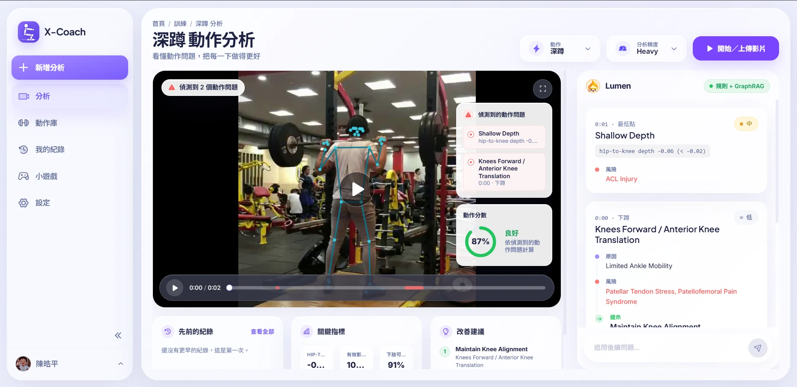

# x-coach

[English](README.MD) · **繁體中文**



*網頁版的深蹲分析畫面：影片上疊著骨架與問題時間軸，中間列出規則偵測到的動作問題與其成因、風險，右側是 Lumen 依知識圖譜給出的解釋。*

x-coach 是一個可解釋運動指導回饋的研究原型。它以一張涵蓋 16 個動作的生物力學知識圖譜為底，把影像感知、規則式生物力學檢查、輕量分類器，以及對專案知識的本地檢索串起來，讓畫面上的視覺訊號能變成講得出理由的教練回饋。（影片分析目前只做深蹲；知識圖譜與 app 內的動作瀏覽已經涵蓋全部 16 個動作。）

## 這個專案在做什麼

- 以 MediaPipe 或 RTMPose 相容的輸出，從深蹲影片抽出姿態關鍵點。
- 為已標註的深蹲片段建立 pose-only 與 VideoMAE 兩種特徵表示。
- 針對深蹲錯誤標籤訓練輕量的影片層級分類器。
- 建立 REHAB24-6 的單次反覆骨架特徵與正確性分類器。
- 用可解釋的姿態規則偵測常見的深蹲動作問題。
- 從專案筆記、文件與知識圖譜內容建立並查詢本地 RAG 索引。
- 提供知識圖譜工具，用來抽取、清理、稽核與查詢多動作的生物力學概念（16 個動作 = 5 個完整動作 + 11 個一般動作骨架）。

## 專案結構

- `src/pose/` — 姿態抽取、姿態特徵、視角估計與規則偵測。
- `src/video/` — VideoMAE 特徵抽取與影片層級分類器。
- `src/knowledge/` — 知識圖譜、檢索與本地 RAG 工具。
- `src/rehab24/` — REHAB24-6 的 manifest、特徵抽取、融合與正確性分類。
- `scripts/pose/` — 姿態流程與姿態分析的進入點。
- `scripts/video/` — VideoMAE 與分類器實驗的進入點。
- `scripts/knowledge/` — 知識圖譜與 RAG 的進入點。
- `scripts/rehab24/` — REHAB24-6 實驗的進入點。
- `backend/` — 把姿態／規則／檢索流程包成 FastAPI 服務（見 `backend/README.md`）。
- `frontend/` — React + Vite（yarn）前端：骨架疊圖、問題時間軸、GraphRAG 回饋（見 `frontend/README.md`）。
- `data/` — 資料集、標註、處理後的姿態、特徵，以及快取的 RAG 資產。
- `demo/` — 瀏覽器 demo 素材與姿態估計原型程式碼。
- `docs/` — 比較長的操作說明。
- `notes/` — 研究筆記與實驗結果。
- `tests/` — 核心行為與分析工具的 Python 單元測試（pytest）。前端測試用 Vitest，放在 `frontend/`（`yarn test`）。

## 資料位置

- `data/Squat/Unlabeled_Dataset/` — 未標註的原始影片與抽出的姿態 JSON。
- `data/Squat/Labeled_Dataset/` — 已標註片段、切分檔、標籤、姿態 JSON、姿態特徵與 VideoMAE 特徵。
- `data/kg/` — 知識圖譜檔案與正規化對應表。
- `data/rag/vector_db/` — 本地 RAG 的 chunk、embedding 與 manifest。

## 環境設定

建立並啟用 Python 虛擬環境，然後安裝套件：

```bash
pip install -r requirements.txt
```

只有要跑 Gemini 版的知識圖譜抽取時才需要設定 `GOOGLE_API_KEY`。

### Docker（網頁版）

前後端也可以用容器跑，本機不必裝 Python 或 Node：

```bash
cp .env.example .env          # 每個值都是選填，留空會自動降級
docker compose up --build     # 前端在 :8080，API 文件在 :8000/docs
```

加上 `-f docker-compose.dev.yml` 可開熱重載（Vite 在 :5173，uvicorn 加 `--reload`）。`scripts/`
底下的研究流程沒有容器化——它們需要完整的 `requirements.txt` 和資料集，請用本機的 `.venv`
跑。細節見 [docs/docker.md](docs/docker.md)。

## 執行各項流程

指令細節放在各自的 script 目錄：

- [姿態相關 scripts](scripts/pose/README.md)
- [影片相關 scripts](scripts/video/README.md)
- [REHAB24-6 scripts](scripts/rehab24/README.md)
- [知識圖譜與 RAG scripts](scripts/knowledge/README.md)

## 文件

- [用 Docker 跑網頁版](docs/docker.md)
- [整體流程與 agent harness 概觀](docs/ai-coach-pipeline-and-agent-harness.md)
- [跨動作的知識圖譜 schema](docs/kg-schema-generalization.md)
- [部署到 Azure Container Apps](docs/azure-deployment.md)
- `notes/` 收錄實驗結果與研究筆記。
- `tests/` 對幾個核心模組來說，本身就是可執行的範例。

## 專案目標

把視覺訊號、結構化的生物力學知識與檢索式的建議連起來，做出講得出理由的教練回饋——目前先做深蹲，底下是一張涵蓋多個動作的生物力學知識圖譜。
