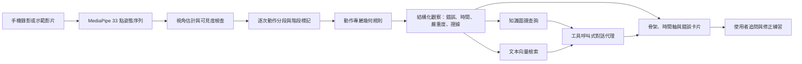
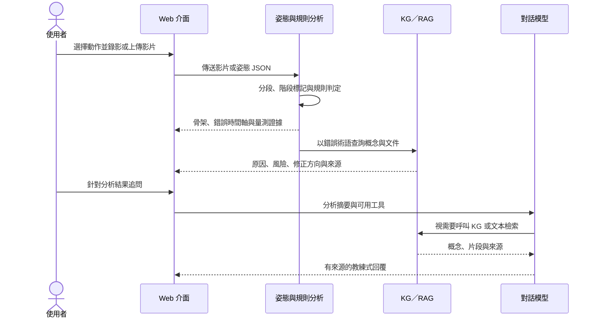

# 結合可解釋姿態規則與知識檢索之 AI 運動教練：多動作原型系統與初步評估

> TANET 2026 投稿工作稿 v0.2（2026-08-11）
> 建議投稿領域：醫療科技與大健康應用／運動科技與健康促進
> 作者、服務單位、電子郵件：待補

**圖 1　研究圖像摘要。** 系統將單鏡頭運動影片轉為姿態序列，以逐次動作規則產生可稽核的錯誤證據，再由知識圖譜與文本檢索提供回饋依據，最後於互動介面呈現觀察、證據與修正方向。圖中不表示任何特定角度門檻已獲臨床或跨資料集驗證。

## 摘要

現有動作品質評估多以單一分數表示表現，難以回答哪裡錯、何時錯、應如何修正；通用大型語言模型能生成自然語言建議，卻不保證那些建議有運動生物力學依據。本研究提出的單鏡頭 AI 運動教練原型把第一層判斷交給可稽核的姿態證據：以 MediaPipe 取得 33 個人體關鍵點，將影片切分為個別反覆動作，再依動作類型與拍攝視角計算關節角度、相對位移與左右對稱性，並判定每條規則在該視角下是否可觀察。輸出的每一筆錯誤都標明它落在哪一段影格、嚴重到什麼程度、有多少信心，以及支持它的原始量測。錯誤術語接著進入知識層：統一圖譜涵蓋 16 種動作，含 2,145 個節點與 3,290 條關係，文本檢索增強生成的向量索引則含 3,307 個文本區塊；多輪對話代理以工具呼叫取得分析紀錄、圖譜概念與文獻片段，回覆因而保留來源軌跡。影片特徵這條路並未帶來增量。VideoMAE 在 Fitness-AQA 深蹲為 0.640、在 REHAB24-6 受試者留一交叉驗證為 0.657，與姿態幾何的 0.650 及單鏡頭骨架的 0.634 同一量級，但以驗證集校準機率再等權平均的後期融合為 0.648，未超過姿態幾何單獨的 0.650，成對 95% 信賴區間自 −0.059 至 0.056。把受試者自畫面中抹除之後，模型仍達 0.627，保留了完整畫面高於機率水準幅度的 91%。規則式方法的價值則在另一處：判準可以被自己的資料否證。弓箭步稽核中，原先以底部較彎曲的膝判斷前導腿，在 174 次反覆與兩個相機上只有 0.623 與 0.474 的正確率，改以腳部前後位置的候選量測則是 0.959 與 0.894，該替換尚未進入產線。部署主線因此設在可解釋幾何：影片特徵與姿態冗餘，而支撐它的分數多半不必看見受試者的像素。

**關鍵詞：** 動作品質評估、人體姿態估計、可解釋人工智慧、知識圖譜、檢索增強生成、運動科技

## 一、前言

運動訓練的品質不只取決於完成次數，也取決於關節排列、活動幅度與動作節奏，以及不同身體部位之間的協調。缺乏專業教練陪同時，錄影後自行比對示範影片仍然高度主觀，短暫或局部的動作錯誤尤其不容易辨識。動作品質評估（Action Quality Assessment, AQA）因此嘗試由影片預測表現分數或技術品質。早期 AQA 工作已證明時空特徵可同時支援細粒度動作辨識、評語生成與分數估計，但最終輸出仍常以整段影片的分數為中心 [1]。知道自己表現較差，並不會告訴使用者下一次該改什麼。

運動場景又比一般動作辨識更困難。相機視角、衣著、器材遮擋與光線都會影響姿態估計，而需辨識的錯誤往往只是局部關節、短時間內的細微偏差。Fitness-AQA 的研究顯示，利用運動週期與領域知識建立自監督表徵，可改善健身動作錯誤偵測 [2]；近期的 FLEX 則把多視角影片、三維姿態、表面肌電與健身知識圖譜組合在一起，反映 AQA 正由單一分數轉向多模態與結構化回饋 [3]。這個方向的代價落在取得條件上：高成本感測器與多視角同步攝影都不在一般使用者以手機錄影的情境內，大型模型則墊高了推論成本。

大型語言模型擅長把技術訊號轉為自然語言，但參數內的知識難以更新，也不必然說得出回答的來源。檢索增強生成（Retrieval-Augmented Generation, RAG）以外部非參數記憶提供相關文本，可改善知識密集任務的事實性與可追溯性 [4]；圖結構檢索則保存動作、錯誤、原因、風險與修正之間的關係 [5]。若視覺前端先產生錯誤標籤，後端再據以生成流暢建議，錯誤會逐層放大。本研究因此不把語言模型當作第一判斷者：先以可檢查的姿態量測形成結構化觀察，再讓知識檢索與語言模型負責解釋及互動。

本研究要問的是，在單鏡頭、低成本的使用條件下，能不能建立一條由姿態證據到知識來源皆可追蹤的運動回饋流程。這條流程有三個承重點。最底層是基線的選擇：在目前的資料條件下，錯誤判斷應以姿態幾何為主，還是通用影片特徵更適合，只有實驗能決定。基線之上是規則本身的紀律，逐次動作、視角與可觀察性都必須進入判定，未驗證的門檻不得寫成確定事實。最上層落在知識，圖譜、文本 RAG 與工具呼叫式對話要把視覺觀察轉成有來源的修正建議。本文以已完成的研究原型與初步實驗回答上述問題，並在敘述中分開已驗證的模組、標記為 Beta 的規則，以及尚待執行的研究工作。

## 二、文獻探討與理論基礎

### 2.1 從動作品質分數到細粒度錯誤回饋

定位到時間與身體部位的回饋比單一整體分數更接近教練任務，AQA 的輸出也正朝這個方向移動。傳統作法以裁判分數或排名相關係數為目標，Parmar 與 Morris 把動作辨識、評語生成與分數估計放進同一個多任務架構，說明語意描述可協助品質表徵 [1]。健身與復健的使用者要的卻是另一種東西：錯了哪一類、發生在第幾秒、該注意哪個關節。Fitness-AQA 因此把任務定義在專家標註的 BackSquat、BarbellRow 與 OverheadPress 錯誤上，以姿態對比學習與動作解耦處理細微錯誤 [2]。EgoExo-Fitness 的標註更細，從動作邊界與子步驟到技術要點、自然語言評語與品質分數都在同一個資料框架內，做了什麼、何時發生與做得如何因而能一起評估 [6]。ExeChecker 走的是另一條路，以對比學習指出錯誤復健動作中需要關注的關節 [7]。

### 2.2 姿態幾何、時空表徵與可解釋性

MediaPipe BlazePose 由單一人物影像輸出 33 個人體關鍵點，並針對行動裝置的即時推論設計 [8]。這樣的姿態序列可以直接算出髖—膝—踝夾角、膝踝相對位移、軀幹角度與左右不對稱，錯誤判斷因而能回到特定的關節、時間與門檻。代價在單鏡頭本身。投影、遮擋與深度模糊都躲不掉，同一條規則在正面與側面的可觀察性也不相同，可解釋規則於是不能只有一個固定閾值，還得攜帶視角、可見度、作用階段與信心衰減。

VideoMAE V2 以雙重遮罩與漸進式訓練擴展影片遮罩自編碼器，可建立通用時空表徵 [9]，捕捉姿態以外的外觀與運動脈絡。在小型、類別不平衡而受試者外觀明顯的資料上，這類模型學到的也可能是人物或背景，不是技術品質。這項疑慮不必停留在推測：本研究以移除受試者的對照實驗直接量測，結果見 4.5 節。實際系統仍以幾何量測為主，VideoMAE 只保留為研究基線，並以多個隨機種子、平衡準確率與特異度，以及受試者分離的切分，檢查模型是不是只學會預測多數類別。

### 2.3 知識檢索、圖譜推理與生成式回饋

RAG 把生成模型接上外部文件索引，回答因而能依查詢取得較新且可追溯的內容 [4]。圖式 RAG 則把文件中的實體及關係組織成圖，處理跨文件、跨概念的關聯問題 [5]。兩者在運動教練場景各有分工：文字檢索找得到具體的研究段落，知識圖譜表達得了動作階段、錯誤型態、可能原因、風險與修正提示之間的關係。它們不應互相取代，而應分別回傳可引用的文件與可遍歷的概念，再交由生成模組整合。

生成文字的流暢度不等於忠實度。RAGAS 把檢索相關性、回答忠實度與回答品質分開評估，提供了不依賴完整人工標準答案的 RAG 評估方向 [10]。本研究據此把來源保留寫進系統的資料結構：工具呼叫的名稱、查詢與回傳的概念或文件來源都隨對話儲存，檢索工具若沒有來源，介面就不顯示引文。這降低了生成內容在沒有證據時被當成專業結論的風險，但 RAG 並未因此消除幻覺，仍須以專家評閱與自動化忠實度指標驗證。

## 三、研究方法與步驟

### 3.1 研究範圍與資料

本研究將核心視覺任務由連續品質分數回歸收斂為錯誤偵測、錯誤分類、逐次動作定位與可解釋回饋。主要深蹲資料包含 1,739 支有標註影片，其中 1,623 支具有正式訓練、驗證與測試切分，另有 4,970 支未標註影片可供後續自監督學習。現有標籤包括 knees forward、knees inward 與 shallow depth，但標註粒度與類別比例不完全一致，因此不將本資料描述為完整 AQA 分數資料集。

外部驗證使用 REHAB24-6，該資料集提供 6 種復健動作、雙視角 RGB、二維與三維骨架、逐次動作邊界及正確／錯誤標籤 [11]。本研究以受試者留一交叉驗證比較骨架、VideoMAE 與融合特徵，並以弓箭步資料稽核規則。FLEX、EgoExo-Fitness 與 ExeChecker 留待後續，用於跨視角、技術要點與關節層級回饋的外部驗證 [3], [6], [7]。

### 3.2 系統架構

**圖 2　系統資料流。** 產線主路徑先形成可檢查的姿態與規則證據，再啟動知識檢索與生成；VideoMAE 僅作為實驗基線，未接入目前的線上判斷路徑。

感知層提供兩條輸入路徑：影片上傳至後端由 MediaPipe 擷取姿態，或在瀏覽器端先擷取姿態 JSON 再送至分析端點。兩條路徑進入同一個動作登錄器。每一個動作偵測器都要宣告自己需要的量測、反覆動作訊號、訊號極性、起始狀態、階段切分方式與規則集合，前端因而可以直接由後端登錄表取得可分析的動作，不必另外維護一份清單。

逐次動作分段器先由動作專屬訊號找出完整反覆，再於每一次反覆內重新標記準備、下降、底部、上升或完成等階段。規則只在有意義的視角、階段與可見度條件下評估，輸出錯誤代碼、起訖影格、峰值影格、嚴重度、信心、可觀察性與原始量測。多次反覆的影片因此不會只用一個全域最低點，介面也能把錯誤區段精確畫在時間軸上。

知識層採統一的多動作圖譜，而不是每種動作各建一個孤立知識庫。動作、階段與錯誤使用動作命名空間，原因、風險及修正概念則在多動作間共享。規則產生錯誤術語之後，系統同時查詢圖譜鄰居與向量文本；對話代理可反覆呼叫 `get_analysis`、`kg_query` 與 `rag_search`，串流介面會顯示每一次工具執行的狀態。分析、工具軌跡與來源可儲存至 Supabase，影片可放在本地物件儲存或 Cloudflare R2。除對話模型外，影片姿態、規則與本地檢索都能離線執行。

### 3.3 感知層的實驗設計

深蹲基線在相同的輕量多層感知器與資料切分下，比較 VideoMAE 影片層級特徵及 654 維姿態幾何特徵。影片特徵取分類路徑的表徵：對編碼器輸出的所有 token 取平均後套用 fc_norm，再對同一影片的多個 clip 取平均。這一步與影像模型的慣例不同，必須寫清楚——VideoMAE 的編碼器不含 CLS token，序列的第一個 token 是第一個 tubelet 左上角的 patch，而不是整段影片的摘要；fc_norm 又只存在於分類模型，僅載入骨幹無法重現該表徵。每個設定執行 5 個隨機種子，分類閾值與模型檢查點僅由驗證集決定，測試集只評估一次。正類偏多，主要指標因而取平衡準確率、macro F1、召回率與特異度，並把 always-positive 與 always-negative 納入基準，避免僅以正類 F1 高估模型。

融合與捷徑對照的判定規則在取得任何結果之前先行寫定並提交版本控制，包括主要臂別、分母、種子集合、統計方法與保留門檻。此程序針對的是一個具體風險：兩種融合方法乘上三種標籤模式會產生六個候選差值，若等看到數字再挑選，等同以最佳選擇冒充單一假設檢定。融合的信賴區間以測試集 244 支影片為重抽單位做成對拔靴法，兩臂共用同一組重抽索引。Fitness-AQA 沒有可靠的受試者對應，1,623 個標註樣本又各自來自相異的來源影片，受試者層級的重抽因而做不出來；同一人出現在多支影片的可能性在此資料集偵測不到，這個區間可能偏樂觀。

REHAB24-6 實驗採受試者留一交叉驗證，比較單鏡頭骨架、VideoMAE 與早期特徵串接。弓箭步的規則稽核使用 8 位受試者、174 次人工標記反覆與兩個正交相機，檢查規則訊號與整體正確／錯誤標籤之間是否存在資訊關聯。資料沒有逐一錯誤類型的標籤，這項稽核因而不能解讀為單一規則的精確率驗證，也不以合併反覆的列聯表推導顯著性。

## 四、實際操作與初步結果

### 4.1 使用流程與介面輸出

**圖 3　實際操作時序。** 使用者先取得不依賴語言模型的結構化分析；多輪對話在其後發生，且每次檢索皆保留工具與來源紀錄。

系統已設計 16 種動作的規則偵測器，其中 14 種登錄於執行時登錄表。未登錄的兩種在設計階段就因為規則與資料集判準對不起來而暫緩，決定與理由一併留在規格文件裡。14 種登錄動作中只有深蹲標記為已驗證，其餘 13 種顯示為 Beta：規則有程式也有測試，但還沒有足以支持正式效度宣稱的逐錯誤外部證據。知識圖譜涵蓋 16 種動作，可檢索知識的動作因而多於可執行視覺分析的動作，介面與論文都必須維持這個差異。

截至本稿版本，統一知識圖譜含 2,145 個節點與 3,290 條關係，向量索引含 3,307 個文本區塊。Web 介面已能呈現同步骨架、錯誤時間軸、規則證據、知識圖譜鄰居、分析紀錄與多輪工具呼叫對話。後端與研究程式的完整測試為 2,023 項通過、1 項預期失敗，前端正式建置亦通過。這些數字驗證的是工程可重現性與元件整合，不等同於動作規則的臨床效度或教練等級的準確度。

### 4.2 深蹲特徵基線

表 1 列出相同切分與閾值選擇策略下的三個設定。VideoMAE 為 0.640，與姿態幾何的 0.650 相差 0.010。

**表 1　Fitness-AQA 深蹲影片層級錯誤分類，5 個種子的測試集平衡準確率（combined 標籤）。**

| 特徵設定 | Test balanced accuracy | 說明 |
| --- | ---: | --- |
| VideoMAE | 0.640 ± 0.021 | 通用時空表徵 |
| 姿態幾何，未正規化 | 0.585 ± 0.022 | 特徵未經標準化 |
| 姿態幾何，訓練集正規化 | 0.650 ± 0.012 | 目前可部署基線 |

姿態幾何的兩列顯示前處理的影響可與特徵種類的影響相當：以訓練折統計標準化後由 0.585 升至 0.650，幅度大於標準化後的姿態與 VideoMAE 之間的 0.010。兩類特徵的比較因此只在各自的前處理設定下成立。後續各節一律以標準化後的姿態幾何 0.650 為比較基準。

原始實驗中，always-positive baseline 的正類 F1 約為 0.83；部分模型雖同樣取得約 0.83 的 F1，特異度卻低至約 0.04。在正類偏多的資料上僅報正類 F1 會產生誤導，本研究因此以平衡準確率與特異度為主。

### 4.3 REHAB24-6 跨受試者結果

表 2 為受試者留一交叉驗證的結果。VideoMAE 為 0.657，高於單鏡頭 MediaPipe 骨架的 0.634，低於 NLF 三維骨架的 0.668。標籤置換的虛無對照落在 0.497，與設計相符：置換在受試者內以反覆動作為單位執行，各受試者的正例率不變，機率水準因而未被更動。

**表 2　REHAB24-6 受試者留一交叉驗證，9 折平衡準確率。**

| 特徵設定 | Balanced accuracy | 判讀 |
| --- | ---: | --- |
| VideoMAE | 0.657 ± 0.049 | 與骨架同一量級 |
| RTMPose 二維骨架 | 0.571 | 單鏡頭骨架 |
| MediaPipe 骨架 | 0.634 | 可部署的單鏡頭基線 |
| NLF 三維骨架 | 0.668 | 本表最高 |
| 標籤置換虛無對照 | 0.497 | 機率水準 |

採留一交叉驗證而非單一受試者分離切分，是為了讓折數由一折增為九折，可對每位受試者報告成對差值，避免以單一切分的落差推論泛化能力。表 2 未列 Vicon 標記式骨架：該特徵需重新產生，在完成之前不列出無法重跑的數值。

### 4.4 融合實驗

姿態與影片特徵的融合以兩種方式測試。早期融合直接串接 654 維姿態與 768 維影片特徵；後期融合則讓兩個分支各自訓練，於驗證集上以 Platt 縮放校準機率後等權平均，融合後的閾值同樣只由驗證集決定。後期融合為事前登錄的主要臂別，理由與結果無關：早期串接的容量會由維度較高的分支主導，正規化能處理尺度而無法處理容量。

後期融合為 0.648 ± 0.008，相對姿態幾何的 0.650 為 −0.003，成對 95% 信賴區間自 −0.059 至 0.056。早期融合為 0.641 ± 0.019，召回率下降 0.066 而特異度上升 0.047，代表決策被推往預測正常，而非判斷變準。事前設定的五項保留門檻中，平均差值與信賴區間下限兩項未通過，因此本研究不將影片特徵列為預設輸入。

後期融合的表現接近兩個分支中較強的那一個，而未超越它。這個型態在 REHAB24-6 的早期串接上也出現過，跨資料集與跨融合方法重複，指向同一個解釋：影片特徵所帶的訊息與姿態幾何重疊，並非互補。

### 4.5 捷徑對照：移除受試者之後仍保留九成訊號

上述結果只說明影片特徵不提供增量，未說明它自身的 0.640 由什麼撐起。本研究以四個對照拆解，各對照僅改變輸入畫面，抽取與訓練程序完全相同。

**表 3　Fitness-AQA 深蹲，輸入內容對照，5 個種子的測試集平衡準確率。**

| 輸入內容 | Balanced accuracy | 高於機率水準 |
| --- | ---: | ---: |
| 完整畫面 | 0.640 ± 0.021 | 0.140 |
| 僅受試者（背景移除後補灰邊） | 0.666 ± 0.012 | 0.166 |
| 僅場景（受試者以周邊像素內插抹除） | 0.627 ± 0.019 | 0.127 |
| 人框位置、大小與片長等 12 個純量，不含像素 | 0.578 ± 0.023 | 0.078 |
| 解析度與長寬比等 4 個純量，不含受試者資訊 | 0.498 ± 0.016 | −0.002 |

把受試者自畫面抹除後仍達 0.627，相當於完整畫面高於機率水準幅度的 91%。完全不含像素、僅描述人框位置大小與片長的對照亦達 0.578，佔 56%。第五列排除了錄影脈絡的解釋：只給解析度與長寬比、不含任何受試者資訊時，結果精準落在機率水準，錄影格式本身不帶標籤資訊。撐起那 56% 的是關於受試者的粗略幾何——人框跨影格取聯集，其高度編碼了下蹲的垂直行程，片長則編碼節奏，兩者都是極粗糙的動作代理。這也解釋了第三列：受試者雖被抹除，補洞留下的矩形仍把這些幾何留在畫面上，場景像素只再貢獻 0.049。

第二列的方向與直覺相反。移除背景後表現上升 0.026，也高於姿態幾何的 0.650，代表場景對這個模型不只是無益，而是干擾。此列不宜逕行解讀為背景是雜訊：裁切同時改變了四件事，除背景外還包括救回被前處理裁掉的身體、提高身體的有效解析度、以及幾何正規化。本資料集有 53% 的影片為非正方形，前處理的短邊縮放加中央裁切使其中 38% 的影片未將受試者完整送入模型。分離這四項需要一個保留背景但同樣消除裁切的對照，該實驗已規劃但尚未執行。

這個結果限縮了 Fitness-AQA 上所有影片特徵數值的解釋範圍，表 1 的 0.640 也在其中。它不否定影片特徵含有動作資訊，只是指出在這份資料上，多數表現不需要看見受試者。

### 4.6 可解釋規則的稽核價值

弓箭步稽核展示了規則式方法的另一項價值：規則不只可解釋，也可以被否證。原先系統以底部時較彎曲的膝判斷前導腿，在 174 次反覆中，此方法於兩個相機的正確率僅 0.623 與 0.474。資料集的標記式三維骨架顯示這個假設本身就接近機率水準，並非單純受到二維投影影響。改以腳部前後位置建立的候選量測，在兩個單鏡頭視角則達 0.959 與 0.894。候選尚未完成產線替換與全規則重跑，本研究因此沒有調整門檻，弓箭步偵測器也持續標記為 Beta。固定規則的可信度來自可重播、可比較與可撤回的證據鏈，而不是規則看起來符合直覺。

## 五、未來展望

感知效度仍是最優先的研究工作。深蹲資料要依視角重新分析錯誤的可觀察性，建立 per-class、per-view 的混淆矩陣與錯誤案例集。多動作規則則要逐一取得帶有錯誤類型的人工標註，否則只能判斷規則訊號與整體正確性是否相關，不能宣稱偵測了特定錯誤。弓箭步的候選前導腿量測應在獨立任務中替換，重跑所有規則，再以受試者層級的統計評估。受試者人數少的資料一律採 leave-one-subject-out、bootstrap 信賴區間或受試者層級置換檢定，不把同一人的多次反覆當成獨立樣本。

影片特徵這條線的下一步已由 4.5 節決定。在確認裁切增益究竟來自移除背景，還是來自救回被裁掉的身體之前，任何以人物裁切為基礎的設計都建立在未分離的混淆上，優先執行的因而是保留背景而同樣消除裁切的對照。若增益確實來自背景移除，才值得為人物裁切輸入另立一次事前登錄的融合實驗。事後嘗試的姿態加人物裁切後期融合為 0.682，同時高於兩個分支，是本研究至今唯一一次融合超越其輸入的情形；但這個數值是在看過主要臂別失敗之後才取得，信賴區間下限仍為負，不能用以推翻 4.4 節的判定。

未標註深蹲影片可用於對比學習或動作週期自監督，前提是正負樣本的設計不會把人物、視角或背景當成捷徑——4.5 節顯示這項風險在本資料集上真實存在。單鏡頭的離面深度仍是重要限制，後續可比較更穩定的直接 image-to-3D 模型、多視角或深度感測，但指標應該是具體的錯誤決策有沒有改善，而不是平均關節位置誤差。

知識與生成層的驗證另有一套。以 RAGAS 的檢索相關性與忠實度指標 [10]，搭配具證照教練或運動專家的盲評，分別比較無檢索、純文本 RAG、知識圖譜檢索及雙軌檢索。專家評估要拆成觀察正確性、因果表述保守度、修正可操作性、引用支持度與潛在安全風險，而不是只評整體像不像教練。證據不足時，系統應該可以輸出無法由目前視角判定或請使用者重新拍攝，而不是為了把話說完而補上推測。

系統本身則朝非同步分析佇列、端側姿態推論、資料最小化與更完整的使用者研究發展。正式 TANET 定稿前，仍需補齊作者資訊、使用者或專家研究、RAG 忠實度實驗、各圖表的最終版面及倫理與資料使用聲明。現階段的結論是：以可解釋姿態證據作為判斷主體、以知識檢索作為生成約束，已形成可運作的 AI 運動教練原型。選擇姿態幾何作為主線的理由不在於影片特徵太弱——在適當的池化設定下，它在兩個資料集上都與骨架同一量級——而在於它與姿態幾何冗餘，且其表現有九成在受試者被移除後仍然存在。可運作不等於已具專家效度，系統是否安全、能否跨使用者、跨視角與跨動作泛化，仍須以更細緻的外部標註與專家評估證明。

## 參考文獻

[1] P. Parmar and B. T. Morris, “What and How Well You Performed? A Multitask Learning Approach to Action Quality Assessment,” in *Proc. IEEE/CVF Conf. Computer Vision and Pattern Recognition (CVPR)*, 2019, pp. 304–313. [Online]. Available: https://arxiv.org/abs/1904.04346

[2] P. Parmar, A. Gharat, and H. Rhodin, “Domain Knowledge-Informed Self-Supervised Representations for Workout Form Assessment,” in *Computer Vision – ECCV 2022*, vol. 13698, 2022, pp. 105–123. doi: 10.1007/978-3-031-19839-7_7.

[3] H. Yin, L. Gu, P. Parmar, L. Xu, T. Guo, W. Fu, Y. Zhang, and T. Zheng, “FLEX: A Large-Scale Multi-Modal Multi-Action Dataset for Fitness Action Quality Assessment,” arXiv:2506.03198, 2025. [Online]. Available: https://arxiv.org/abs/2506.03198

[4] P. Lewis *et al*., “Retrieval-Augmented Generation for Knowledge-Intensive NLP Tasks,” in *Advances in Neural Information Processing Systems*, vol. 33, 2020. [Online]. Available: https://arxiv.org/abs/2005.11401

[5] D. Edge, H. Trinh, N. Cheng, J. Bradley, A. Chao, A. Mody, S. Truitt, and J. Larson, “From Local to Global: A Graph RAG Approach to Query-Focused Summarization,” arXiv:2404.16130, 2024. [Online]. Available: https://arxiv.org/abs/2404.16130

[6] Y.-M. Li, W.-J. Huang, A.-L. Wang, L.-A. Zeng, J.-K. Meng, and W.-S. Zheng, “EgoExo-Fitness: Towards Egocentric and Exocentric Full-Body Action Understanding,” arXiv:2406.08877, 2024. [Online]. Available: https://arxiv.org/abs/2406.08877

[7] Y. Gu, M. Patel, and M. Betke, “ExeChecker: Where Did I Go Wrong?” arXiv:2412.10573, 2024. [Online]. Available: https://arxiv.org/abs/2412.10573

[8] V. Bazarevsky, I. Grishchenko, K. Raveendran, T. Zhu, F. Zhang, and M. Grundmann, “BlazePose: On-device Real-time Body Pose Tracking,” arXiv:2006.10204, 2020. [Online]. Available: https://arxiv.org/abs/2006.10204

[9] L. Wang, B. Huang, Z. Zhao, Z. Tong, Y. He, Y. Wang, Y. Wang, and Y. Qiao, “VideoMAE V2: Scaling Video Masked Autoencoders with Dual Masking,” in *Proc. IEEE/CVF Conf. Computer Vision and Pattern Recognition (CVPR)*, 2023, pp. 14549–14560. [Online]. Available: https://openaccess.thecvf.com/content/CVPR2023/html/Wang_VideoMAE_V2_Scaling_Video_Masked_Autoencoders_With_Dual_Masking_CVPR_2023_paper.html

[10] S. Es, J. James, L. Espinosa-Anke, and S. Schockaert, “RAGAS: Automated Evaluation of Retrieval Augmented Generation,” arXiv:2309.15217, 2023. [Online]. Available: https://arxiv.org/abs/2309.15217

[11] A. Černek, J. Sedmidubský, and P. Budíková, “REHAB24-6: Physical Therapy Dataset for Analyzing Pose Estimation Methods,” in *Proc. 17th Int. Conf. Similarity Search and Applications (SISAP)*, 2024, pp. 18–33. Dataset doi: 10.5281/zenodo.13305826.

<!-- 投稿前待辦：補作者中英文資訊、英文摘要、經費與利益衝突聲明、資料授權與倫理聲明。 -->
<!-- 投稿前待辦：依 TANET 2026 官方範本排成 PDF，確認頁數限制、雙欄樣式、圖表解析度與未編頁碼要求。 -->
<!-- 投稿前待辦：若專家研究或 RAGAS 實驗尚未完成，勿把未來式改寫成已完成結果。 -->
<!-- 投稿前待辦：4.3 節的 Vicon 骨架列需重新產生特徵後補回，或明確說明該列不列出的理由。 -->
<!-- 投稿前待辦：4.5 節的裁切增益分離實驗（保留背景、消除裁切）完成後回填，屆時 5 節的對應段落需改寫。 -->
