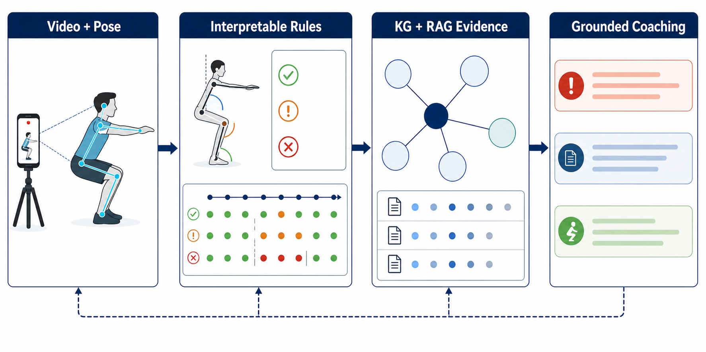
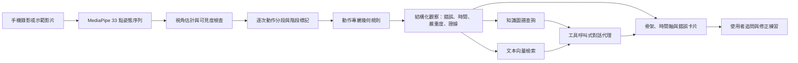
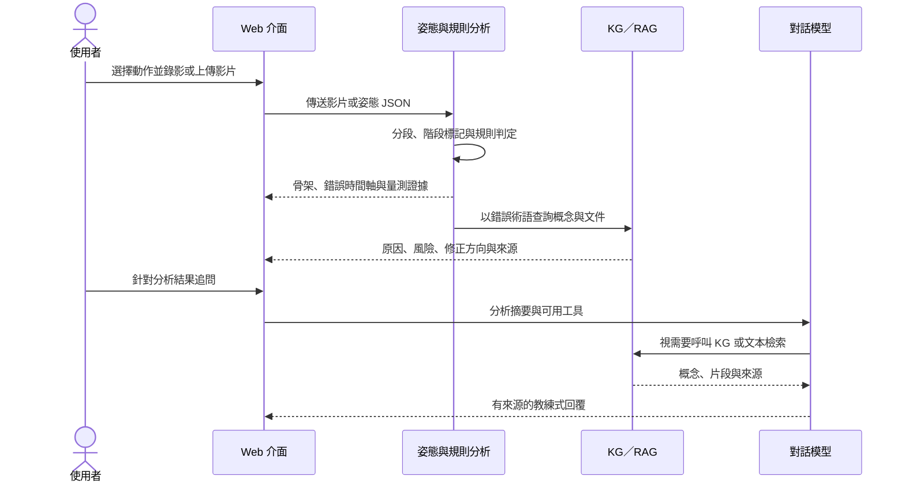

# 結合可解釋姿態規則與知識檢索之 AI 運動教練：多動作原型系統與初步評估

> TANET 2026 投稿工作稿 v0.3（2026-08-12）
> 建議投稿領域：醫療科技與大健康應用／運動科技與健康促進
> 作者、服務單位、電子郵件：待補

**圖 1　研究圖像摘要。** 系統將單鏡頭運動影片轉為姿態序列，以逐次動作規則產生可稽核的錯誤證據，再由知識圖譜與文本檢索提供回饋依據，最後於互動介面呈現觀察、證據與修正方向。圖中不表示任何特定角度門檻已獲臨床或跨資料集驗證。

## 摘要

現有動作品質評估多以單一分數表示表現，難以回答哪裡錯、何時錯、應如何修正；通用大型語言模型能生成自然語言建議，卻不保證那些建議有運動生物力學依據。本研究提出的單鏡頭 AI 運動教練原型把第一層判斷交給可稽核的姿態證據：以 MediaPipe 取得 33 個人體關鍵點，將影片切分為個別反覆動作，再依動作類型與拍攝視角計算關節角度、相對位移與左右對稱性，並判定每條規則在該視角下是否可觀察。輸出的每一筆錯誤都標明它落在哪一段影格、嚴重到什麼程度、有多少信心，以及支持它的原始量測。原型已為 16 種動作實作規則偵測器，14 種登錄於執行時登錄表，合計 48 條規則實作，其中 8 條在登錄時就設為不觸發——錯誤本身有文獻依據，單鏡頭卻感測不到它，登錄而不觸發是為了讓規格與程式維持一對一對應。錯誤術語接著進入知識層：統一圖譜涵蓋 16 種動作，含 2,145 個節點與 3,290 條關係，其中錯誤 312 個、成因 260 個、風險 115 個、修正提示 92 個，由錯誤節點出發即可走到成因、風險、階段與修正；文本檢索增強生成的向量索引含 3,307 個文本區塊。多輪對話代理以工具呼叫取得分析紀錄、圖譜概念與文獻片段，回覆因而保留來源軌跡，而檢索工具的介面說明明確告訴模型，圖譜與文獻回傳的是一般參考知識，不是這支影片的觀察。深蹲是 14 種動作中唯一有逐錯誤標註可以對照的一種，比對結果並不齊整：以 1,623 支標註影片重播規則，knees_inward 的平衡準確率為 0.604、特異度 0.867，精確率只有 0.299，每觸發十次約七次是誤報；knees_forward 則只在側面視角判定，而這批資料的側面僅佔 8.5%，全視角合併的數字量到的是視角分布而非規則品質，重跑必須逐視角分層。同一組規則換到 RTMPose 骨架，knees_inward 的召回率由 0.341 升到 0.500，誤報同時由 185 升到 397，門檻與姿態器是綁在一起的。規則式方法的價值也在此：判準可以被自己的資料否證。弓箭步稽核中，原先以底部較彎曲的膝判斷前導腿，在 174 次反覆與兩個相機上只有 0.623 與 0.474 的正確率，改以腳部前後位置的候選量測則是 0.959 與 0.894，該替換尚未進入產線。姿態模組本身也以量測決定：瀏覽器端的 Lite 模型與後端 Heavy 模型在 40 支影片上只有一半給出相同的錯誤集合，分析因而固定走 Heavy；REHAB24-6 的受試者留一交叉驗證則顯示三維骨架 0.668 對產線 MediaPipe 骨架 0.634，方向一致但未達顯著（配對 Wilcoxon p = 0.203）。

**關鍵詞：** 動作品質評估、人體姿態估計、可解釋人工智慧、知識圖譜、檢索增強生成、運動科技

## 一、前言

運動訓練的品質不只取決於完成次數，也取決於關節排列、活動幅度與動作節奏，以及不同身體部位之間的協調。缺乏專業教練陪同時，錄影後自行比對示範影片仍然高度主觀，短暫或局部的動作錯誤尤其不容易辨識。動作品質評估（Action Quality Assessment, AQA）因此嘗試由影片預測表現分數或技術品質。早期 AQA 工作已證明時空特徵可同時支援細粒度動作辨識、評語生成與分數估計，但最終輸出仍常以整段影片的分數為中心 [1]。知道自己表現較差，並不會告訴使用者下一次該改什麼。

運動場景又比一般動作辨識更困難。相機視角、衣著、器材遮擋與光線都會影響姿態估計，而需辨識的錯誤往往只是局部關節、短時間內的細微偏差。Fitness-AQA 的研究顯示，利用運動週期與領域知識建立自監督表徵，可改善健身動作錯誤偵測 [2]；近期的 FLEX 則把多視角影片、三維姿態、表面肌電與健身知識圖譜組合在一起，反映 AQA 正由單一分數轉向多模態與結構化回饋 [3]。這個方向的代價落在取得條件上：高成本感測器與多視角同步攝影都不在一般使用者以手機錄影的情境內，大型模型則墊高了推論成本。

大型語言模型擅長把技術訊號轉為自然語言，但參數內的知識難以更新，也不必然說得出回答的來源。檢索增強生成（Retrieval-Augmented Generation, RAG）以外部非參數記憶提供相關文本，可改善知識密集任務的事實性與可追溯性 [4]；圖結構檢索則保存動作、錯誤、原因、風險與修正之間的關係 [5]。若視覺前端先產生錯誤標籤，後端再據以生成流暢建議，錯誤會逐層放大。本研究因此不把語言模型當作第一判斷者：先以可檢查的姿態量測形成結構化觀察，再讓知識檢索與語言模型負責解釋及互動。

本研究要問的是，在單鏡頭、低成本的使用條件下，能不能建立一條由姿態證據到知識來源皆可追蹤的運動回饋流程。這條流程有三個承重點。最底層是姿態模組，它決定規則拿到的量測有多可信；換一個姿態器就換掉一組門檻，這件事要用量測而不是直覺來確認。姿態之上是規則本身的紀律，逐次動作、視角與可觀察性都必須進入判定，未驗證的門檻不得寫成確定事實，能與標註對照的就把對照結果寫出來，即使結果不好看。最上層落在知識，圖譜、文本 RAG 與工具呼叫式對話要把視覺觀察轉成有來源的修正建議。本文以已完成的研究原型回答上述問題，重點放在系統各層真正在跑什麼、以及每一層目前有多少證據支撐，並在敘述中分開已驗證的模組、標記為 Beta 的規則，以及尚待執行的研究工作。

## 二、文獻探討與理論基礎

### 2.1 從動作品質分數到細粒度錯誤回饋

定位到時間與身體部位的回饋比單一整體分數更接近教練任務，AQA 的輸出也正朝這個方向移動。傳統作法以裁判分數或排名相關係數為目標，Parmar 與 Morris 把動作辨識、評語生成與分數估計放進同一個多任務架構，說明語意描述可協助品質表徵 [1]。健身與復健的使用者要的卻是另一種東西：錯了哪一類、發生在第幾秒、該注意哪個關節。Fitness-AQA 因此把任務定義在專家標註的 BackSquat、BarbellRow 與 OverheadPress 錯誤上，以姿態對比學習與動作解耦處理細微錯誤 [2]。EgoExo-Fitness 的標註更細，從動作邊界與子步驟到技術要點、自然語言評語與品質分數都在同一個資料框架內，做了什麼、何時發生與做得如何因而能一起評估 [6]。ExeChecker 走的是另一條路，以對比學習指出錯誤復健動作中需要關注的關節 [7]。

### 2.2 姿態幾何、深度來源與可解釋性

MediaPipe BlazePose 由單一人物影像輸出 33 個人體關鍵點，並針對行動裝置的即時推論設計 [8]。這樣的姿態序列可以直接算出髖—膝—踝夾角、膝踝相對位移、軀幹角度與左右不對稱，錯誤判斷因而能回到特定的關節、時間與門檻。代價在單鏡頭本身。投影、遮擋與深度模糊都躲不掉，同一條規則在正面與側面的可觀察性也不相同，可解釋規則於是不能只有一個固定閾值，還得攜帶視角、可見度、作用階段與信心衰減。

單鏡頭骨架之外還有一條路：由影像直接估計三維人體，把投影掉的離面資訊取回來。這條路的代價落在推論成本與部署難度，是否值得換，應該看跨受試者條件下的錯誤判定有沒有變準，而不是看平均關節位置誤差降了多少。4.5 節以受試者留一交叉驗證比較二維與三維骨架，回答的正是這個問題。

### 2.3 知識檢索、圖譜推理與生成式回饋

RAG 把生成模型接上外部文件索引，回答因而能依查詢取得較新且可追溯的內容 [4]。圖式 RAG 則把文件中的實體及關係組織成圖，處理跨文件、跨概念的關聯問題 [5]。兩者在運動教練場景各有分工：文字檢索找得到具體的研究段落，知識圖譜表達得了動作階段、錯誤型態、可能原因、風險與修正提示之間的關係。它們不應互相取代，而應分別回傳可引用的文件與可遍歷的概念，再交由生成模組整合。

生成文字的流暢度不等於忠實度。RAGAS 把檢索相關性、回答忠實度與回答品質分開評估，提供了不依賴完整人工標準答案的 RAG 評估方向 [9]。本研究據此把來源保留寫進系統的資料結構：工具呼叫的名稱、查詢與回傳的概念或文件來源都隨對話儲存，檢索工具若沒有來源，介面就不顯示引文。這降低了生成內容在沒有證據時被當成專業結論的風險，但 RAG 並未因此消除幻覺，仍須以專家評閱與自動化忠實度指標驗證。

## 三、研究方法與步驟

### 3.1 研究範圍與資料

本研究將核心視覺任務由連續品質分數回歸收斂為錯誤偵測、錯誤分類、逐次動作定位與可解釋回饋。主要深蹲資料包含 1,739 支有標註影片，其中 1,623 支具有正式訓練、驗證與測試切分，另有 4,970 支未標註影片可供後續自監督學習。現有標籤包括 knees forward、knees inward 與 shallow depth，但標註粒度與類別比例不完全一致，因此不將本資料描述為完整 AQA 分數資料集。這批標註同時是深蹲規則唯一的外部對照，比對方式見 3.3 節、結果見 4.3 節。

外部驗證使用 REHAB24-6，該資料集提供 6 種復健動作、雙視角 RGB、二維與三維骨架、逐次動作邊界及正確／錯誤標籤 [10]。本研究以受試者留一交叉驗證比較二維與三維骨架特徵，並以弓箭步資料稽核規則。FLEX、EgoExo-Fitness 與 ExeChecker 留待後續，用於跨視角、技術要點與關節層級回饋的外部驗證 [3], [6], [7]。

### 3.2 系統架構

**圖 2　系統資料流。** 產線主路徑先形成可檢查的姿態與規則證據，再啟動知識檢索與生成。錯誤判定不經過語言模型，語言模型只在流程末端負責解釋與互動。

感知層提供兩條輸入路徑：影片上傳至後端由 MediaPipe 擷取姿態，或在瀏覽器端先擷取姿態 JSON 再送至分析端點。兩條路徑進入同一個動作登錄器。每一個動作偵測器都要宣告自己需要的量測、反覆動作訊號、訊號極性、起始狀態、階段切分方式與規則集合，前端因而可以直接由後端登錄表取得可分析的動作，不必另外維護一份清單。

逐次動作分段器先由動作專屬訊號找出完整反覆，再於每一次反覆內重新標記準備、下降、底部、上升或完成等階段。規則只在有意義的視角、階段與可見度條件下評估，輸出的錯誤紀錄帶著時間、嚴重度與原始量測，欄位見 4.1 節。多次反覆的影片因此不會只用一個全域最低點，介面也能把錯誤區段精確畫在時間軸上。

知識層採統一的多動作圖譜，而不是每種動作各建一個孤立知識庫。動作、階段與錯誤使用動作命名空間，原因、風險及修正概念則在多動作間共享。規則產生錯誤術語之後，系統同時查詢圖譜鄰居與向量文本，對話代理再以工具呼叫取用兩者。分析、工具軌跡與來源可儲存至 Supabase，影片可放在本地物件儲存或 Cloudflare R2。除對話模型外，影片姿態、規則與本地檢索都能離線執行。

### 3.3 規則與姿態模組的評估設計

深蹲規則的比對以 Fitness-AQA 的 1,623 支標註影片為對象。規則在每支影片上重播，產生的錯誤區間與標註區間對齊之後，逐類計算真陽性、假陽性、精確率、召回率、特異度與區段 IoU；同一組規則另在 RTMPose 骨架上重播一次，用來分辨結果是規則造成的還是姿態器造成的。判定以影片為單位，因此度量的是規則會不會在這支影片上出現，而不是它在每一次反覆上的表現。姿態模組的另一項對照直接比較兩個 MediaPipe 複雜度設定：同一批影片分別以 Lite 與 Heavy 擷取姿態，送進同一組規則，比較兩者產生的錯誤集合是否完全相同。

骨架來源的比較在 REHAB24-6 上採受試者留一交叉驗證，九位受試者輪流留出，比較單鏡頭二維骨架與直接由影像估計的三維骨架。虛無對照以標籤置換建立，置換在受試者內以反覆動作為單位執行，各受試者的正例率不變，機率水準因而未被更動。

正類偏多是這批資料共同的形狀，指標選擇必須據此設定。深蹲資料上的 always-positive 基準，正類 F1 約為 0.83；前置實驗中以該資料訓練的分類器，有的同樣取得約 0.83 的 F1，特異度卻低至約 0.04。只報正類 F1 會把一個從不說不的模型描述成表現良好，主要指標因而取平衡準確率與特異度，並把恆正與恆負兩個基準一併納入比較。

弓箭步的規則稽核使用 8 位受試者、174 次人工標記反覆與兩個正交相機，檢查規則訊號與整體正確／錯誤標籤之間是否存在資訊關聯。資料沒有逐一錯誤類型的標籤，這項稽核因而不能解讀為單一規則的精確率驗證，也不以合併反覆的列聯表推導顯著性。

## 四、實際操作與初步結果

### 4.1 使用流程與介面輸出

**圖 3　實際操作時序。** 使用者先取得不依賴語言模型的結構化分析；多輪對話在其後發生，且每次檢索皆保留工具與來源紀錄。

一次分析交回的不是一句評語，而是一份可以逐項回放的紀錄。系統為每一筆偵測到的錯誤記下錯誤代號與名稱、起訖影格與對應時間、嚴重度最高的峰值影格、它落在哪一個動作階段、嚴重度與信心、該規則在當前視角下的可觀察性等級，以及觸發它的原始量測與所用門檻，另附支持該規則的文獻出處與被引用的那一項發現。

圖 4 是這份紀錄在分析頁面上的樣子。影片上疊著逐影格對齊的骨架，下方時間軸把每一個錯誤畫成它實際發生的那一段，而不是整支影片；偵測到的動作問題以卡片列出，每張卡片帶著自己的量測值與門檻，關鍵指標區另外交代這次分析的拍攝視角、有效影格比例與下肢可見度——這些是判斷結果可不可信的前提，不是裝飾。使用者看到的每一句話都追得回一個數字。頁面上唯一不是量出來的東西是動作分數，它由偵測結果在裝置端換算而來，介面本身就寫明這一點，以免一個由規則導出的數字被當成獨立的量測。

**圖 4　動作分析頁面。** 同步骨架、錯誤時間軸、帶量測與門檻的問題卡片、關鍵指標與教練對話同在一個畫面上；對話面板會列出每一次工具呼叫，回覆中的建議因而能追到它的來源。

同一個錯誤在多次反覆中重複出現時，介面只給一張卡片，取最嚴重的那一次，並記錄它出現在哪幾次反覆。嚴重度、時間與證據一律取自同一次反覆，不會把某一次的嚴重度配上另一次的量測。分不出完整反覆時，系統退回整段分析，並在回傳內容標明退回的原因是沒有偵測到反覆、只有不完整的反覆，還是該動作未啟用分段。這個欄位存在的理由是使用端要能分辨這份分析涵蓋了什麼，而不是收到一個看起來一樣、意義卻不同的結果。

後端與研究程式的完整測試為 2,278 項通過、1 項預期失敗，前端正式建置亦通過。這些數字驗證的是工程可重現性與元件整合，不等同於動作規則的臨床效度或教練等級的準確度。

### 4.2 規則偵測器的實作盤點

系統已為 16 種動作設計規則偵測器，其中 14 種登錄於執行時登錄表，合計 48 條規則實作。表 1 列出登錄的 14 種動作、各自的規則數與用來切分反覆的訊號。每一個偵測器都要宣告自己的量測集合、反覆訊號、訊號極性、起始狀態與階段切分函式。

圖 5 的動作庫把這張登錄表直接攤開給使用者看。頁面依身體部位分成下肢、上肢、核心與全身四區，可分析的動作由後端依登錄表產生，因此登錄一個新偵測器就會多一張可點選的卡片，前端不必改；沒有登錄的動作仍然列出，但標為尚未開放且不可點，動作庫因而是完整的，同時不會用錯的規則去分析使用者的影片。規則尚未對照過標註資料的動作掛上 Beta 標籤，這個標籤直接來自偵測器的驗證旗標，不是文案。介面上可檢索知識的動作多於可分析的動作，這個差距是刻意保留的：知識圖譜認得 16 種動作，視覺分析認得 14 種。

**圖 5　動作庫。** 動作依身體部位分區，可分析的卡片由偵測器登錄表產生，未驗證的掛 Beta 標籤，未登錄的標為尚未開放。

**表 1　登錄於執行時登錄表的 14 種動作偵測器。規則數的括號內為登錄但永不觸發者；反覆訊號欄的 ↓ 表示取該量測的極小值、↑ 取極大值。**

| 動作 | 規則數 | 反覆訊號 | 狀態 |
| --- | ---: | --- | --- |
| 深蹲 | 5 | 膝角 ↓ | 已驗證 |
| 肩上推舉 | 5 | 肘角 ↑ | Beta |
| 伏地挺身 | 5（1） | 肘角 ↓ | Beta |
| 弓箭步 | 4 | 膝角 ↓ | Beta |
| 划船 | 4 | 肘角 ↓ | Beta |
| 彈力帶擴胸 | 4（1） | 腕距 ↑ | Beta |
| 手臂 VW 開合 | 4（1） | 上臂仰角 ↓ | Beta |
| 硬舉 | 3 | 髖角 ↓ | Beta |
| 二頭彎舉 | 3 | 肘角 ↓ | Beta |
| 手臂外展 | 3（1） | 上臂仰角 ↑ | Beta |
| 仰臥起坐 | 2（1） | 髖角 ↓ | Beta |
| 臀橋 | 2（1） | 髖角 ↑ | Beta |
| 腿部外展 | 2（1） | 腿幹夾角 ↑ | Beta |
| 軀幹旋轉 | 2（1） | 旋轉位移比 ↑ | Beta |

48 條之中有 8 條登錄後永不觸發，而這與規則被撤回是兩件事。永不觸發指的是錯誤本身有文獻依據，單鏡頭的感測條件卻撐不起它，而兩個代表性的例子壞在不同的地方。肩胛翼狀突出要看肩胛骨相對於胸廓的位置，MediaPipe 的 33 個關鍵點裡沒有肩胛骨內緣，也沒有下角，換哪個視角都量不到。聳肩代償則是量到了錯的骨頭：MediaPipe 的肩點是盂肱關節而非肩峰，在 REHAB24-6 的外展資料上，標記式骨架中代表肩峰的那一點在整個動作只移動基線高度的 1.0%，MediaPipe 的肩點卻移動 11.2%，規格的 18% 門檻因而在 178 次反覆中對肩峰只觸發 1 次、對 MediaPipe 觸發 172 次；它追到的其實是手臂抬起，而抬臂時肩關節上移是肩肱節律，是動作本身而不是代償。量測不到並不表示錯誤不存在，把規則登錄下來並讓它保持沉默，規格與程式才維持一對一對應，日後也不會有人把規則的缺席讀成該錯誤不存在。撤回則是連登錄都沒有：判準本身站不住，或是它在資料上被否證，這時留一個沉默的空殼反而是在宣稱一件未經證實的事。

14 種登錄動作中只有深蹲標記為已驗證，它也是唯一有逐錯誤人工標註可以對照的動作，比對結果見 4.3 節。其餘 13 種顯示為 Beta，規則有程式也有測試，卻沒有錯誤層級的外部標註可以支持正式的效度宣稱。剩下兩種設計完成而未登錄，理由來自資料而非工程進度。開合跳唯一與資料集判準重疊的那條規則，在人工全數判為正確的 11 段動作、91 次反覆上有 79.1% 的觸發率，門檻定在 1.3 個肩寬，正確族群的中位數卻是 1.163；高抬腿的規則則連一條與資料集判準重疊的都沒有，其中兩條的否證來自構造本身——站立動作找不到可靠的垂直參考，而三部同步外部相機拍同一瞬間所量到的骨盆傾斜彼此矛盾，差距大於規則要判的門檻。

### 4.3 深蹲規則對標註資料的驗證

深蹲的五條規則中有三條對得上 Fitness-AQA 的錯誤標註。把規則在 1,623 支有標註影片上重播，將偵測區間與標註區間對齊之後，結果並不均勻。表 2 列出該次比對回報的兩類規則，並把同一組規則換到 RTMPose 骨架上重播作為對照。

**表 2　深蹲規則與 Fitness-AQA 標註的比對，n = 1,623，全視角合併。前移為 knees_forward、內夾為 knees_inward，MP 為 MediaPipe、RT 為 RTMPose。精確率、召回率與特異度可由本表推得，文中直接引用。**

| | 前移 MP | 前移 RT | 內夾 MP | 內夾 RT |
| --- | ---: | ---: | ---: | ---: |
| TP | 1 | 5 | 79 | 116 |
| FP | 0 | 0 | 185 | 397 |
| FN | 1108 | 1104 | 153 | 116 |
| 平衡準確率 | 0.500 | 0.502 | 0.604 | 0.607 |
| 區段 IoU | 0.000 | 0.001 | 0.045 | 0.055 |

knees_forward 那一列不能讀成規則太嚴。這條規則只在視角估計判為側面且信心足夠時才做判定，其餘視角它輸出的是一筆低可觀察性的無法判定紀錄，而不是宣告沒有錯誤。這批資料的視角分布是 rear_oblique 1,075、rear 410、side 138，側面只佔 8.5%，全視角合併的那一列因而把九成以上根本不該計分的影片算成漏報。視角閘門在此是照設計運作的，錯的是分母。這一列真正可讀的只有假陽性 0：規則不亂報。它準不準要看側視角子集，而該次比對的逐視角結果沒有隨數據留存，必須重跑才有答案。

knees_inward 的分母則是實的。它在所有視角上都計算，只以視角調整可觀察性等級，而 1,485 支影片落在它觀察得到的後方視角。平衡準確率 0.604、特異度 0.867，代價寫在精確率 0.299 上：每觸發十次，約有七次是誤報。區段 IoU 0.045 又說明另一件事，即使是非判斷對了，錯誤在時間軸上被畫到哪裡仍然很粗——而介面正是把錯誤畫在時間軸上。

換骨架不能解決這件事。同一組規則改用 RTMPose，knees_inward 的召回率由 0.341 升到 0.500，誤報同時由 185 升到 397，平衡準確率幾乎不動。門檻是繞著 MediaPipe 的幾何訂出來的，換一個姿態器就得連門檻一起重訂，這也是 4.5 節分析固定走 Heavy 的同一個理由。

這次比對執行於 2026 年 5 月，早於逐次動作分段、可觀察性排序與同錯誤合併進入產線，當時規則在整段影片上評估；分段之後每條規則只看選定的反覆，數字要重跑才對得上目前的產線，本研究不以舊數字描述現況。shallow depth 那一類也未在該次比對中回報。這些數字沒有讓深蹲規則變好，它們界定的是已驗證的意思：有一組標註可以對照過，而不是通過了某個門檻。這個旗標目前仍是人工判斷，把它改成由標註集與回歸腳本撐腰，是尚未完成的工作。

### 4.4 判準被自己的資料推翻：弓箭步稽核

弓箭步稽核展示了規則式方法的另一項價值：規則不只可解釋，也可以被否證。原先系統以底部時較彎曲的膝判斷前導腿，在 174 次反覆中，此方法於兩個相機的正確率僅 0.623 與 0.474。資料集的標記式三維骨架顯示這個假設本身就接近機率水準，並非單純受到二維投影影響。改以腳部前後位置建立的候選量測，在兩個單鏡頭視角則達 0.959 與 0.894。候選尚未完成產線替換與全規則重跑，本研究因此沒有調整門檻，弓箭步偵測器也持續標記為 Beta。固定規則的可信度來自可重播、可比較與可撤回的證據鏈，而不是規則看起來符合直覺。

### 4.5 姿態模組的選型

規則的量測全部來自姿態模組，模組換了，判定就跟著換。系統在錄影當下以 MediaPipe 的 Lite 模型畫即時骨架，分析則預設走 Heavy，這個分工不是效能取捨的直覺，而是量出來的：40 支深蹲影片上，Lite 與 Heavy 產生完全相同錯誤集合的只有 20 支，一致率 50%。差異足以改變使用者看到的結論，所以即時疊圖用的姿態不會被當成分析結果，介面上選擇 Lite 的說明也直接寫出這個數字。

姿態來源還有更上游的一層。表 3 為 REHAB24-6 受試者留一交叉驗證的結果，比較的是同一套下游流程接不同骨架：直接由影像估計的 NLF 三維骨架為 0.668，產線使用的 MediaPipe 骨架為 0.634，RTMPose 二維骨架為 0.571，標籤置換的虛無對照落在 0.497。

**表 3　REHAB24-6 受試者留一交叉驗證，9 折平衡準確率。MediaPipe 為產線使用的骨架，最末列為機率水準。**

| 骨架 | 平衡準確率 |
| --- | ---: |
| RTMPose 二維 | 0.571 |
| MediaPipe | 0.634 |
| NLF 三維 | 0.668 |
| 標籤置換對照 | 0.497 |

三維與產線二維之間的 0.034 方向一致而未達顯著：配對差值為 +0.034 ± 0.063，九折中六折為正，Wilcoxon 檢定 p = 0.203。REHAB24-6 只有 9 位可用受試者，跨受試者變異又大，這個量級撐不到統計顯著。方向的一致性另有旁證，逐動作拆解顯示 NLF 在 6 種動作上全數不低於 MediaPipe，增益集中在離面深度大的上肢動作，桌上伏地挺身 +0.106、手臂 VW +0.076，偏向面內的下肢動作則小，腿部外展 +0.013、弓箭步 +0.019、深蹲 +0.024。表 3 未列 Vicon 標記式骨架：該特徵需重新產生，在完成之前不列出無法重跑的數值。就目前的證據，0.034 不足以要求產線改用推論成本高得多的三維估計，它標示的是規則所依賴的量測還剩多少改善空間，特別是那些吃離面深度的判準。

### 4.6 知識層、對話代理與紀錄保存

截至本稿版本，統一圖譜含 2,145 個節點與 3,290 條關係，節點依類別為證據訊號 652、品質面向 358、錯誤 312、成因 260、動作 204、階段 152、風險 115 與修正提示 92。決定檢索能走多遠的是關係而非節點，表 4 列出各類關係的數量。

**表 4　統一知識圖譜的關係組成，共 3,290 條。**

| 關係型態 | 數量 |
| --- | ---: |
| AFFECTS_QUALITY | 862 |
| INDICATED_BY | 713 |
| CAUSED_BY | 461 |
| INCREASES_RISK_OF | 326 |
| HAS_PHASE | 297 |
| HAS_FAULT | 250 |
| OCCURS_IN_PHASE | 237 |
| CORRECTED_BY | 144 |

前兩類把錯誤接到它影響的品質面向與指示它的可量測訊號，其餘六類接的是動作的階段、動作可能出現的錯誤、錯誤發生的階段、成因、風險與修正提示。規則產生一個錯誤術語之後，由該錯誤節點出發即可走到它的成因、它提高的風險、它出現的階段與對應的修正提示，這正是回饋要說的四件事。文本檢索走另一條路，向量索引含 3,307 個文本區塊，回傳的是可引用的文獻段落。圖譜涵蓋 16 種動作，可檢索知識的動作因而多於可執行視覺分析的動作，介面與論文都必須維持這個差異。

對話代理有三個工具：`get_analysis` 取回這支影片被摘要壓掉的完整細節，包含確切量測值與檢索到的原文；`kg_query` 查圖譜的成因、風險與修正；`rag_search` 查文獻段落。工具的介面說明本身承擔了誠實性的工作，它明確告訴模型後兩者回傳的是一般參考知識，說不出這支影片發生了什麼，其中提到的錯誤也未必是這位使用者犯的。串流介面顯示每一次工具執行的狀態，分析、工具軌跡與來源隨對話儲存；檢索工具若沒有回傳來源，介面就不顯示引文。這降低了生成內容在沒有證據時被當成專業結論的風險，但沒有消除幻覺本身。

儲存下來的分析在紀錄頁面重新出現，如圖 6。每一列記著那次分析的動作、拍攝視角、偵測到幾個問題或判為標準動作，以及縮圖與時間，可依動作、結果與時間範圍篩選，也可以逐筆刪除。頁面上方的四項統計裡有一個容易被誤讀的數字：動作正確率。它算的是已載入的那幾次分析，不是全部歷史，因此介面把取樣範圍寫在統計下方，說明這個比率來自最近幾次、總共幾次。同一個原則貫穿整個系統——沒有量到的不要顯示，量到的要說清楚是在什麼範圍上量的。未登入時分析照常執行，只是不留下紀錄。

**圖 6　我的紀錄頁面。** 已存分析可依動作、結果與時間篩選；上方統計標明比率的取樣範圍，避免把最近幾次的正確率讀成長期趨勢。

## 五、未來展望

48 條規則有 8 條登錄後永不觸發，這是系統最明確的缺口。肩胛翼狀突出與聳肩代償量不到，原因不在規則寫法，而在單鏡頭取不回它們需要的離面資訊。多一個拍攝視角或多一部相機，其中一部分就有機會由沉默轉為可判定，改用能取回離面深度的姿態來源也是一條路。前提是每一次解除沉默都要附上該視角下的量測證據。把門檻直接打開，只是拿一條不會觸發的規則換一條會亂觸發的規則。

深蹲的規則比對必須在目前的產線上重跑。表 2 的數字產生於 2026 年 5 月，早於逐次動作分段進入產線，當時規則在整段影片上評估，shallow depth 那一類也沒有回報。重跑時要逐視角分層。knees_forward 只在側面判定，把它放進全視角合併列，量到的是這批資料的視角分布而不是規則品質，先動門檻等於把規則調去迎合錯的分母。側視角在這批資料只有 138 支，要得到穩定結論恐怕得補人工視角標註或擴充側視角樣本。區段 IoU 0.045 指向另一個弱點，時間定位比是非判定更不可靠，需要獨立的定位指標，影片層級的比對代答不了。

其餘 13 種登錄動作缺的是帶有錯誤類型的人工標註。沒有它，能檢定的只有規則訊號與整體正確性是否相關，不能宣稱偵測到特定錯誤，Beta 標籤也就撤不掉。開合跳與高抬腿停在登錄之前，正是這種標註真的存在時會發生的事：判準一旦對得上資料，就可能不通過。弓箭步的候選前導腿量測應在獨立任務中替換並重跑全部規則。受試者人數少的資料一律採 leave-one-subject-out、bootstrap 信賴區間或受試者層級置換檢定，不把同一人的多次反覆當成獨立樣本。已驗證這個旗標目前仍是人工判斷，把它改成由標註集與回歸腳本撐腰，是這條線的終點。

兩件事共用同一個判準：規則能不能被外部證據推翻。沉默的 8 條說明感測條件撐不起哪些判準，待驗證的 13 種說明證據還沒到位，弓箭步則說明證據到位時判準真的會被推翻。這些數字留在論文裡，是因為它們與規則同時可見才構成一條可稽核的證據鏈，而把判斷交給黑箱分數的系統連讓它們浮現的位置都沒有。可運作不等於已具專家效度。

## 參考文獻

[1] P. Parmar and B. T. Morris, “What and How Well You Performed? A Multitask Learning Approach to Action Quality Assessment,” in *Proc. IEEE/CVF Conf. Computer Vision and Pattern Recognition (CVPR)*, 2019, pp. 304–313. [Online]. Available: https://arxiv.org/abs/1904.04346

[2] P. Parmar, A. Gharat, and H. Rhodin, “Domain Knowledge-Informed Self-Supervised Representations for Workout Form Assessment,” in *Computer Vision – ECCV 2022*, vol. 13698, 2022, pp. 105–123. doi: 10.1007/978-3-031-19839-7_7.

[3] H. Yin, L. Gu, P. Parmar, L. Xu, T. Guo, W. Fu, Y. Zhang, and T. Zheng, “FLEX: A Large-Scale Multi-Modal Multi-Action Dataset for Fitness Action Quality Assessment,” arXiv:2506.03198, 2025. [Online]. Available: https://arxiv.org/abs/2506.03198

[4] P. Lewis *et al*., “Retrieval-Augmented Generation for Knowledge-Intensive NLP Tasks,” in *Advances in Neural Information Processing Systems*, vol. 33, 2020. [Online]. Available: https://arxiv.org/abs/2005.11401

[5] D. Edge, H. Trinh, N. Cheng, J. Bradley, A. Chao, A. Mody, S. Truitt, and J. Larson, “From Local to Global: A Graph RAG Approach to Query-Focused Summarization,” arXiv:2404.16130, 2024. [Online]. Available: https://arxiv.org/abs/2404.16130

[6] Y.-M. Li, W.-J. Huang, A.-L. Wang, L.-A. Zeng, J.-K. Meng, and W.-S. Zheng, “EgoExo-Fitness: Towards Egocentric and Exocentric Full-Body Action Understanding,” arXiv:2406.08877, 2024. [Online]. Available: https://arxiv.org/abs/2406.08877

[7] Y. Gu, M. Patel, and M. Betke, “ExeChecker: Where Did I Go Wrong?” arXiv:2412.10573, 2024. [Online]. Available: https://arxiv.org/abs/2412.10573

[8] V. Bazarevsky, I. Grishchenko, K. Raveendran, T. Zhu, F. Zhang, and M. Grundmann, “BlazePose: On-device Real-time Body Pose Tracking,” arXiv:2006.10204, 2020. [Online]. Available: https://arxiv.org/abs/2006.10204

[9] S. Es, J. James, L. Espinosa-Anke, and S. Schockaert, “RAGAS: Automated Evaluation of Retrieval Augmented Generation,” arXiv:2309.15217, 2023. [Online]. Available: https://arxiv.org/abs/2309.15217

[10] A. Černek, J. Sedmidubský, and P. Budíková, “REHAB24-6: Physical Therapy Dataset for Analyzing Pose Estimation Methods,” in *Proc. 17th Int. Conf. Similarity Search and Applications (SISAP)*, 2024, pp. 18–33. Dataset doi: 10.5281/zenodo.13305826.

<!-- 投稿前待辦：補作者中英文資訊、英文摘要、經費與利益衝突聲明、資料授權與倫理聲明。 -->
<!-- 投稿前待辦：依 TANET 2026 官方範本排成 PDF，確認頁數限制、雙欄樣式、圖表解析度與未編頁碼要求。 -->
<!-- 投稿前待辦：若專家研究或 RAGAS 實驗尚未完成，勿把未來式改寫成已完成結果。 -->
<!-- 投稿前待辦：4.5 節的 Vicon 骨架列需重新產生特徵後補回，或明確說明該列不列出的理由。 -->
