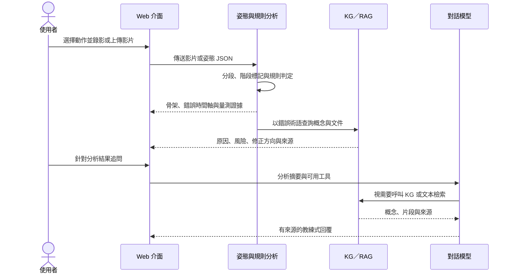

# 結合可解釋姿態規則與知識檢索之 AI 運動教練：多動作原型系統與初步評估

> TANET 2026 投稿工作稿 v0.1（2026-08-09）  
> 建議投稿領域：醫療科技與大健康應用／運動科技與健康促進  
> 作者、服務單位、電子郵件：待補

**圖 1　研究圖像摘要。** 系統將單鏡頭運動影片轉為姿態序列，以逐次動作規則產生可稽核的錯誤證據，再由知識圖譜與文本檢索提供回饋依據，最後於互動介面呈現觀察、證據與修正方向。圖中不表示任何特定角度門檻已獲臨床或跨資料集驗證。

## 摘要

現有動作品質評估多以單一分數表示表現，難以回答「哪裡錯、何時錯、應如何修正」；通用大型語言模型雖能生成自然語言建議，卻可能欠缺運動生物力學依據。本研究提出一套結合單鏡頭姿態估計、逐次動作分段、可解釋幾何規則、知識圖譜、文本檢索增強生成與多輪對話的 AI 運動教練原型。系統目前以 MediaPipe 取得 33 個人體關鍵點，將影片切分為個別反覆動作，依動作與視角計算關節角度、相對位移、對稱性與可觀察性，再輸出錯誤區段、嚴重度、信心值及量測證據。知識層涵蓋 16 種動作，共 2,145 個節點、3,290 條關係與 3,307 個文本區塊；對話代理可呼叫分析紀錄、知識圖譜與文本檢索三類工具，使回覆保留來源軌跡。初步實驗顯示，在深蹲錯誤分類上，姿態幾何特徵的平均平衡準確率為 0.581，略高於 VideoMAE 特徵的 0.555；在 REHAB24-6 的受試者分離設定中，MediaPipe 骨架達 0.665，優於 VideoMAE 的 0.544，但仍低於 Vicon 骨架的 0.723。結果支持以可解釋幾何作為目前部署主線，同時也顯示視角、遮擋、類別不平衡與規則外部效度仍是主要限制。本研究的貢獻在於建立一條可操作、可稽核且能明確標示證據成熟度的運動回饋流程，而非僅追求單一品質分數。

**關鍵詞：** 動作品質評估、人體姿態估計、可解釋人工智慧、知識圖譜、檢索增強生成、運動科技

## 一、前言

運動訓練的品質不只取決於完成次數，也涉及關節排列、活動幅度、動作節奏與不同身體部位之協調。對缺乏專業教練陪同的使用者而言，錄影後自行與示範影片比較仍高度主觀，且不容易辨識短暫或局部的動作錯誤。動作品質評估（Action Quality Assessment, AQA）因此嘗試從影片預測表現分數或技術品質。早期 AQA 工作已證明時空特徵可同時支援細粒度動作辨識、評語生成與分數估計，但最終輸出仍常以整段影片的分數為中心 [1]。對實際教學而言，僅知道「表現較差」並不足以形成可執行的修正策略。

運動場景又比一般動作辨識更困難。相機視角、衣著、器材遮擋與光線會影響姿態估計，而需辨識的錯誤往往只是局部關節或短時間的細微偏差。Fitness-AQA 的研究顯示，利用運動週期與領域知識建立自監督表徵，可改善健身動作錯誤偵測 [2]；近期 FLEX 更結合多視角影片、三維姿態、表面肌電與健身知識圖譜，反映 AQA 正由單一分數轉向多模態與結構化回饋 [3]。然而，高成本感測器、多視角同步攝影或大型模型不一定適合一般使用者以手機錄影的情境。

另一方面，大型語言模型適合把技術訊號轉為自然語言，但模型參數內的知識難以更新，也不必然能指出回答來源。檢索增強生成（Retrieval-Augmented Generation, RAG）透過外部非參數記憶提供相關文本，可改善知識密集任務的事實性與可追溯性 [4]；圖結構檢索則能進一步保存「動作—錯誤—原因—風險—修正」之間的關係 [5]。不過，若視覺前端先產生錯誤標籤，後端再直接生成流暢建議，錯誤可能在各層被放大。因此，本研究不把語言模型當作第一判斷者，而是先以可檢查的姿態量測形成結構化觀察，再讓知識檢索與語言模型負責解釋及互動。

本研究的核心問題為：在單鏡頭、低成本的使用條件下，能否建立一條由姿態證據到知識來源皆可追蹤的運動回饋流程？具體而言，本研究探討三項問題。第一，姿態幾何特徵相較於通用影片特徵，是否更適合作為目前資料條件下的錯誤判斷基線；第二，規則式偵測如何處理逐次動作、視角與可觀察性，並避免把未驗證門檻包裝成確定事實；第三，知識圖譜、文本 RAG 與工具呼叫式對話如何把視覺觀察轉成有來源的修正建議。本文以已完成的研究原型與初步實驗回答上述問題，並明確區分已驗證模組、Beta 規則與尚待執行的研究工作。

## 二、文獻探討與理論基礎

### 2.1 從動作品質分數到細粒度錯誤回饋

傳統 AQA 常以裁判分數或排名相關係數作為主要目標。Parmar 與 Morris 將動作辨識、評語生成與 AQA 分數估計納入多任務學習，說明語意描述可協助品質表徵 [1]。但在健身與復健情境中，使用者通常更需要錯誤類型、發生時間與應注意的關節。Fitness-AQA 因此以專家標註的 BackSquat、BarbellRow 與 OverheadPress 錯誤為任務，並以姿態對比學習及動作解耦處理細微錯誤 [2]。EgoExo-Fitness 進一步提供動作邊界、子步驟、技術要點、自然語言評語與品質分數，將「做了什麼、何時發生、做得如何」納入同一資料框架 [6]；ExeChecker 則利用對比學習找出錯誤復健動作中需要關注的關節 [7]。這些研究共同指出，具有時間與身體部位定位的回饋，比單一整體分數更接近教練任務。

### 2.2 姿態幾何、時空表徵與可解釋性

MediaPipe BlazePose 可由單一人物影像輸出 33 個人體關鍵點，並針對行動裝置即時推論設計 [8]。姿態序列能直接形成髖—膝—踝夾角、膝踝相對位移、軀幹角度與左右不對稱等量測，使錯誤判斷可以回到特定關節、時間與門檻。然而，單鏡頭姿態仍受投影、遮擋與深度模糊影響；同一規則在正面與側面視角的可觀察性並不相同。因此，可解釋規則不能只有固定閾值，還必須攜帶視角、可見度、作用階段與信心衰減資訊。

VideoMAE V2 以雙重遮罩與漸進式訓練擴展影片遮罩自編碼器，能建立通用時空表徵 [9]。此類特徵可捕捉姿態以外的外觀與運動脈絡，但在小型、類別不平衡且受試者外觀明顯的資料上，也可能學到人物或背景而非技術品質。本研究因此將 VideoMAE 保留為研究基線，不直接用於目前上線的規則判斷；實際系統以幾何量測為主，並透過跨 seed、平衡準確率、特異度及受試者分離切分檢查模型是否只學會預測多數類別。

### 2.3 知識檢索、圖譜推理與生成式回饋

RAG 將生成模型與外部文件索引結合，使回答能依查詢取得更新且可追溯的內容 [4]。圖式 RAG 則把文件中的實體及關係組織成圖，適合處理跨文件、跨概念的關聯問題 [5]。在運動教練場景中，文字檢索適合找到具體研究段落，知識圖譜則適合表達動作階段、錯誤型態、可能原因、風險與修正提示之間的關係。兩者不應互相取代，而應分別回傳「可引用文件」與「可遍歷概念」，再由生成模組整合。

生成文字的流暢度不等於忠實度。RAGAS 將檢索相關性、回答忠實度與回答品質分開評估，提供不依賴完整人工標準答案的 RAG 評估方向 [10]。本研究據此將來源保留視為系統資料結構的一部分：工具呼叫的名稱、查詢、回傳概念或文件來源都隨對話儲存；若檢索工具沒有來源，介面不顯示虛構引文。此設計降低了「有生成內容卻沒有證據」被誤認為專業結論的風險，但並不代表 RAG 已消除幻覺，仍須以專家評閱與自動化忠實度指標進一步驗證。

## 三、研究方法與步驟

### 3.1 研究範圍與資料

本研究將核心視覺任務由連續品質分數回歸收斂為「錯誤偵測、錯誤分類、逐次動作定位與可解釋回饋」。主要深蹲資料包含 1,739 支有標註影片，其中 1,623 支具有正式訓練、驗證與測試切分，另有 4,970 支未標註影片可供後續自監督學習。現有標籤包括 knees forward、knees inward 與 shallow depth，但標註粒度與類別比例不完全一致，因此不將本資料描述為完整 AQA 分數資料集。

外部驗證使用 REHAB24-6。該資料集包含 6 種復健動作、雙視角 RGB、二維與三維骨架、逐次動作邊界及正確／錯誤標籤 [11]。本研究以其受試者分離切分比較 Vicon 骨架、MediaPipe 骨架、VideoMAE 與融合特徵，並以弓箭步資料進行規則稽核。FLEX、EgoExo-Fitness 與 ExeCheck 則用於規劃跨視角、技術要點與關節層級回饋的後續外部驗證 [3], [6], [7]。

### 3.2 系統架構

**圖 2　系統資料流。** 產線主路徑先形成可檢查的姿態與規則證據，再啟動知識檢索與生成；VideoMAE 僅作為實驗基線，尚未接入目前的線上判斷路徑。

系統的感知層提供兩種輸入路徑。第一種將影片上傳至後端，由 MediaPipe 擷取姿態；第二種在瀏覽器端先擷取姿態 JSON，再送至分析端點。兩者都會進入同一動作登錄器。每一動作偵測器宣告所需量測、反覆動作訊號、訊號極性、起始狀態、階段切分方式與規則集合，使前端可由後端登錄表自動取得可分析動作，不需維護另一份清單。

逐次動作分段器先從動作專屬訊號找出完整反覆，再於各次反覆內重新標記準備、下降、底部、上升或完成等階段。規則只在具有意義的視角、階段與可見度條件下評估，並輸出錯誤代碼、起訖影格、峰值影格、嚴重度、信心、可觀察性與原始量測。此設計避免多次反覆影片只使用一個全域最低點，也使介面能把錯誤區段精確畫在時間軸上。

知識層採統一多動作圖譜，而非每種動作各自建立孤立知識庫。動作、階段與錯誤使用動作命名空間；原因、風險及修正概念可在多動作間共享。當規則產生錯誤術語後，系統同時查詢圖譜鄰居與向量文本。對話代理可反覆呼叫 `get_analysis`、`kg_query` 與 `rag_search`，並在串流介面顯示工具執行狀態。分析、工具軌跡與來源可儲存至 Supabase；影片可使用本地物件儲存或 Cloudflare R2。除對話模型外，影片姿態、規則與本地檢索皆可離線執行。

### 3.3 實驗設計與評估指標

深蹲基線使用相同的輕量多層感知器與資料切分，比較 VideoMAE 影片層級特徵及 654 維姿態幾何特徵。三種標籤模式各執行 5 個隨機種子，並以驗證集平衡準確率選擇分類閾值。由於正類偏多，主要指標為平衡準確率、macro F1、召回率與特異度；always-positive 及 always-negative 亦納入基準，避免僅以正類 F1 高估模型。

REHAB24-6 實驗採受試者分離方式，比較真實 Vicon 骨架、單鏡頭 MediaPipe 骨架、VideoMAE 與早期特徵串接。弓箭步規則稽核則使用 8 位受試者、174 次人工標記反覆與兩個正交相機，檢查規則訊號是否與整體正確／錯誤標籤具有資訊關聯。由於資料沒有逐一錯誤類型標籤，該稽核不能被解讀為單一規則的精確率驗證，也不以合併反覆的列聯表推導顯著性。

## 四、實際操作與初步結果

### 4.1 使用流程與介面輸出

**圖 3　實際操作時序。** 使用者先取得不依賴語言模型的結構化分析；多輪對話在其後發生，且每次檢索皆保留工具與來源紀錄。

目前系統登錄 11 種規則偵測器，包含深蹲、過頭推舉、伏地挺身、弓箭步、硬舉、划船、彈力帶拉開、二頭彎舉、手臂外展、手臂 V-W 與仰臥起坐。只有深蹲被系統標記為已驗證，其餘 10 種顯示為 Beta，表示規則已有程式與測試，但尚未取得足以支持正式效度宣稱的逐錯誤外部證據。知識圖譜則涵蓋 16 種動作，因此「可檢索知識的動作」多於「可執行視覺分析的動作」，介面與論文均需維持此差異。

截至本稿版本，統一知識圖譜含 2,145 個節點與 3,290 條關係；向量索引含 3,307 個文本區塊。Web 介面已能呈現同步骨架、錯誤時間軸、規則證據、知識圖譜鄰居、分析紀錄與多輪工具呼叫對話。後端與研究程式的完整測試執行結果為 1,764 項通過、1 項預期失敗；前端正式建置亦成功完成。這些結果驗證的是工程可重現性與元件整合，不應等同於動作規則的臨床效度或教練等級準確度。

### 4.2 深蹲特徵基線

表 1 比較相同資料切分與閾值選擇策略下的 VideoMAE 與姿態幾何特徵。三種標籤模式中，姿態特徵的平均平衡準確率皆較高，combined 由 0.555 提升至 0.581，knees forward 由 0.524 提升至 0.573，knees inward 由 0.539 提升至 0.569。改善幅度有限，且 combined 的姿態模型召回率 0.790、特異度僅 0.373，顯示模型仍傾向將正常影片判為錯誤。此結果支持幾何訊號較貼近錯誤定義，但尚不足以作為可靠的最終分類器。

**表 1　深蹲影片層級錯誤分類之 5-seed 平均 test balanced accuracy。**

| 標籤模式 | VideoMAE-only | Pose-only | 差值 |
| --- | ---: | ---: | ---: |
| combined | 0.555 | 0.581 | +0.026 |
| knees forward | 0.524 | 0.573 | +0.049 |
| knees inward | 0.539 | 0.569 | +0.030 |

原始實驗中，always-positive baseline 的正類 F1 約為 0.83；部分模型雖同樣取得約 0.83 的 F1，特異度卻低至約 0.04。這說明在正類偏多的資料上，僅報正類 F1 會產生誤導。採用平衡準確率與特異度後，模型效能多落在 0.53 至 0.59，較能反映目前仍接近弱基線的事實。

### 4.3 REHAB24-6 跨受試者結果

REHAB24-6 的固定受試者分離測試顯示，Vicon 骨架的平衡準確率為 0.723，MediaPipe 單鏡頭骨架為 0.665，VideoMAE-only 為 0.544，VideoMAE 與骨架早期串接為 0.683。MediaPipe 僅比 Vicon 低約 0.058，卻比 VideoMAE 高 0.121；早期融合雖高於 MediaPipe，仍低於 Vicon，且訓練至測試落差較大。這表示正確性訊號主要存在於關節運動學，通用影片嵌入在受試者轉移時可能過度依賴外觀。現階段採姿態幾何與規則作為部署主線，符合實驗結果；未來若重啟融合，應採正規化、分支凍結或 late fusion，而非直接串接全部特徵。

**表 2　REHAB24-6 固定受試者分離測試結果。**

| 特徵設定 | Test balanced accuracy | Train-to-test 落差 | 判讀 |
| --- | ---: | ---: | --- |
| Vicon skeleton | 0.723 | 0.10 | 可作為骨架品質上限基線 |
| MediaPipe skeleton | 0.665 | 0.18 | 可部署的單鏡頭基線 |
| VideoMAE-only | 0.544 | 0.34 | 接近隨機且過擬合明顯 |
| VideoMAE + skeleton | 0.683 | 0.22 | 早期融合未優於 Vicon 骨架 |

### 4.4 可解釋規則的稽核價值

弓箭步稽核展示了規則式方法的另一項價值：規則不只可解釋，也可以被否證。原先系統以「底部時較彎曲的膝」判斷前導腿；在 174 次反覆中，此方法於兩個相機的正確率僅 0.623 與 0.474。資料集的標記式三維骨架顯示此假設本身接近機率水準，而非單純受到二維投影影響。相對地，以腳部前後位置建立的候選量測，在兩個單鏡頭視角可達 0.959 與 0.894。由於該候選尚未完成產線替換與全規則重跑，本研究沒有調整門檻，弓箭步偵測器也持續標記為 Beta。此案例說明，固定規則的可信度來自可重播、可比較與可撤回的證據鏈，而非規則看似符合直覺。

## 五、未來展望

目前最優先的研究工作是完成「感知效度」而非擴張更多介面功能。深蹲資料需要依視角重新分析錯誤可觀察性，建立 per-class、per-view 的混淆矩陣與錯誤案例集；多動作規則需要逐一取得具有錯誤類型的人工標註，否則只能判斷規則訊號是否與整體正確性相關，不能宣稱偵測了特定錯誤。弓箭步候選前導腿量測應在獨立任務中替換、重跑所有規則並以受試者層級統計評估。對只有少數受試者的資料，後續應採 leave-one-subject-out、bootstrap 信賴區間或受試者層級置換檢定，避免把同一人的多次反覆視為獨立樣本。

在模型層面，未標註深蹲影片可用於對比學習或動作週期自監督，但須先確認正負樣本設計不會把人物、視角或背景當成捷徑。VideoMAE 與姿態融合應由 early concatenation 改為 late fusion、gating 或可信度加權，並加入特徵正規化與時間模型。單鏡頭的離面深度仍是重要限制；未來可比較更穩定的直接 image-to-3D 模型、多視角或深度感測，但應以具體錯誤決策是否改善為指標，而非只追求平均關節位置誤差。

在知識與生成層面，將以 RAGAS 的檢索相關性與忠實度指標 [10]，搭配具證照教練或運動專家的盲評，分別比較無檢索、純文本 RAG、知識圖譜檢索及雙軌檢索。專家評估內容應拆成觀察正確性、因果表述保守度、修正可操作性、引用支持度與潛在安全風險，而非只評整體「像不像教練」。當沒有足夠證據時，系統應允許輸出「無法由目前視角判定」或請使用者重新拍攝，而非為了完整回答而補上推測。

最後，系統將朝非同步分析佇列、端側姿態推論、資料最小化與更完整的使用者研究發展。正式 TANET 定稿前，仍需補齊作者資訊、使用者或專家研究、RAG 忠實度實驗、各圖表的最終版面及倫理與資料使用聲明。現階段的結論是：以可解釋姿態證據作為判斷主體、以知識檢索作為生成約束，已形成可運作的 AI 運動教練原型；但「可運作」不等於「已具專家效度」，系統是否安全且能跨使用者、跨視角與跨動作泛化，仍須以更細緻的外部標註與專家評估證明。

## 參考文獻

[1] P. Parmar and B. T. Morris, “What and How Well You Performed? A Multitask Learning Approach to Action Quality Assessment,” in *Proc. IEEE/CVF Conf. Computer Vision and Pattern Recognition (CVPR)*, 2019, pp. 304–313. [Online]. Available: https://arxiv.org/abs/1904.04346

[2] P. Parmar, A. Gharat, and H. Rhodin, “Domain Knowledge-Informed Self-Supervised Representations for Workout Form Assessment,” in *Computer Vision – ECCV 2022*, vol. 13698, 2022, pp. 105–123. doi: 10.1007/978-3-031-19839-7_7.

[3] H. Yin, L. Gu, P. Parmar, L. Xu, T. Guo, W. Fu, Y. Zhang, and T. Zheng, “FLEX: A Large-Scale Multi-Modal Multi-Action Dataset for Fitness Action Quality Assessment,” arXiv:2506.03198, 2025. [Online]. Available: https://arxiv.org/abs/2506.03198

[4] P. Lewis *et al*., “Retrieval-Augmented Generation for Knowledge-Intensive NLP Tasks,” in *Advances in Neural Information Processing Systems*, vol. 33, 2020. [Online]. Available: https://arxiv.org/abs/2005.11401

[5] D. Edge, H. Trinh, N. Cheng, J. Bradley, A. Chao, A. Mody, S. Truitt, and J. Larson, “From Local to Global: A Graph RAG Approach to Query-Focused Summarization,” arXiv:2404.16130, 2024. [Online]. Available: https://arxiv.org/abs/2404.16130

[6] Y.-M. Li, W.-J. Huang, A.-L. Wang, L.-A. Zeng, J.-K. Meng, and W.-S. Zheng, “EgoExo-Fitness: Towards Egocentric and Exocentric Full-Body Action Understanding,” arXiv:2406.08877, 2024. [Online]. Available: https://arxiv.org/abs/2406.08877

[7] Y. Gu, M. Patel, and M. Betke, “ExeChecker: Where Did I Go Wrong?” arXiv:2412.10573, 2024. [Online]. Available: https://arxiv.org/abs/2412.10573

[8] V. Bazarevsky, I. Grishchenko, K. Raveendran, T. Zhu, F. Zhang, and M. Grundmann, “BlazePose: On-device Real-time Body Pose Tracking,” arXiv:2006.10204, 2020. [Online]. Available: https://arxiv.org/abs/2006.10204

[9] L. Wang, B. Huang, Z. Zhao, Z. Tong, Y. He, Y. Wang, Y. Wang, and Y. Qiao, “VideoMAE V2: Scaling Video Masked Autoencoders with Dual Masking,” in *Proc. IEEE/CVF Conf. Computer Vision and Pattern Recognition (CVPR)*, 2023, pp. 14549–14560. [Online]. Available: https://openaccess.thecvf.com/content/CVPR2023/html/Wang_VideoMAE_V2_Scaling_Video_Masked_Autoencoders_With_Dual_Masking_CVPR_2023_paper.html

[10] S. Es, J. James, L. Espinosa-Anke, and S. Schockaert, “RAGAS: Automated Evaluation of Retrieval Augmented Generation,” arXiv:2309.15217, 2023. [Online]. Available: https://arxiv.org/abs/2309.15217

[11] A. Černek, J. Sedmidubský, and P. Budíková, “REHAB24-6: Physical Therapy Dataset for Analyzing Pose Estimation Methods,” in *Proc. 17th Int. Conf. Similarity Search and Applications (SISAP)*, 2024, pp. 18–33. Dataset doi: 10.5281/zenodo.13305826.

<!-- 投稿前待辦：補作者中英文資訊、英文摘要、經費與利益衝突聲明、資料授權與倫理聲明。 -->
<!-- 投稿前待辦：依 TANET 2026 官方範本排成 PDF，確認頁數限制、雙欄樣式、圖表解析度與未編頁碼要求。 -->
<!-- 投稿前待辦：若專家研究或 RAGAS 實驗尚未完成，勿把未來式改寫成已完成結果。 -->
