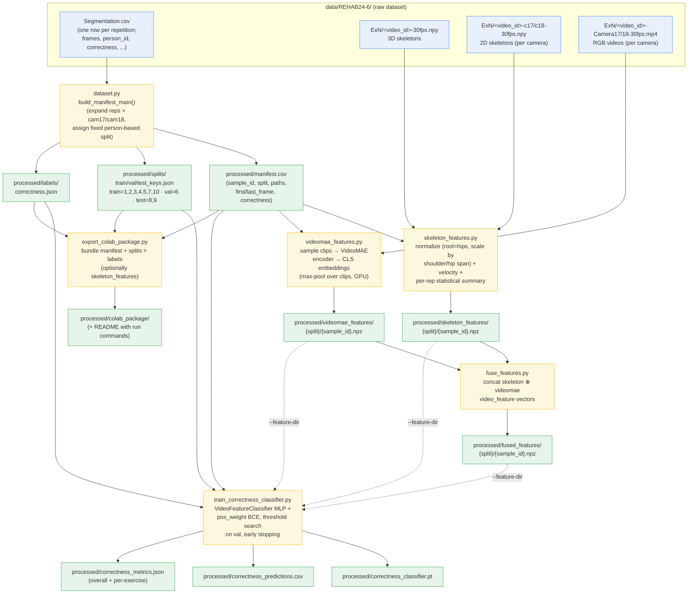

# REHAB24-6 Pipeline

End-to-end flow for turning the raw REHAB24-6 dataset into a trained
repetition-level **correctness** classifier.

## Stage summary

| Stage | Script | Input | Output |
|-------|--------|-------|--------|
| 1. Manifest | `dataset.py` | `Segmentation.csv` | `manifest.csv`, `splits/*_keys.json`, `labels/correctness.json` |
| 2a. Skeleton features | `skeleton_features.py` | 2D/3D skeleton `.npy` | `skeleton_features/{split}/*.npz` |
| 2b. VideoMAE features | `videomae_features.py` | Camera `.mp4` | `videomae_features/{split}/*.npz` |
| 3. Fusion (optional) | `fuse_features.py` | skeleton + videomae `.npz` | `fused_features/{split}/*.npz` |
| 4. Train classifier | `train_correctness_classifier.py` | any feature dir + splits + labels | `*.pt`, predictions CSV, metrics JSON |
| 5. Colab export | `export_colab_package.py` | manifest/splits/labels | `colab_package/` |

**Sample granularity:** one sample per repetition × camera (`cam17`, `cam18`).
**Split policy:** fixed, person-disjoint — train `{1,2,3,4,5,7,10}`, val `{6}`, test `{8,9}`.
**Task:** binary correctness classification per repetition.
